# Tabata`s Confectionery

## Description
This is a comprehensive web application designed for a fictitious confectionery business. The application enables users to view the available products, add or remove products to/from their cart, and place an order. Additionally, the application offers the business owner the ability to add, edit, or delete products. It includes different role levels, such as admin, owner, employee, and customer, each with varying degrees of functionality access. <br>The Front-end of the application is built using React and TypeScript, while the Back-end uses Flask and Python and is powered by a PostgreSQL database. The application is hosted on Netlify for the Front-end, Fly.io for the Back-end, and Bit.io for the database.
 

## Getting Started
  The project can be accessed on **[my GitHub profile on pastry-fe repository,](https://github.com/scarlosteixeira/pastry-fe)** **[and the Back-end on the pastry-be repository;](https://github.com/scarlosteixeira/pastry-be)** You also can access the application on **[Netlify](https://tabatasconfectionery.netlify.app/)**

  ### Back-end
  1. Clone the repository using `git clone https://github.com/scarlosteixeira/pastry-be.git`
  2. install pipenv using `pip install pipenv`
  3. install dependencies using `pipenv install`
  4. Create your PostgreSQL database local server (i`m using pgAdmin 4)
  5. Seed the database using `pipenv run python seed.py`
  6. Run the application using `pipenv run flask run`


  ### Front-end
  1. Clone the repository using `git clone https://github.com/scarlosteixeira/pastry-fe.git`
  2. install dependencies using `npm install`
  3. Make sure that the back-end is running
  4. Run the application using `npm run dev`


## Timeframe & Working Team
This project was completed over the course of 2 weeks as a solo project for the General Assembly Software Engineering Immersive course.

## Technologies Used

### Back-end
* **[Flask](https://flask.palletsprojects.com/en/2.2.x/)**
* **[Flask-SQLAlchemy](https://flask-sqlalchemy.palletsprojects.com/en/3.0.x/)**
* **[Flask-Marshmallow](https://flask-marshmallow.readthedocs.io/en/latest/)**
* **[Flask-bcrypt](https://flask-bcrypt.readthedocs.io/en/1.0.1/)**
* **[pyjwt](https://pyjwt.readthedocs.io/en/stable/)**
* **[Flask-cors](https://flask-cors.readthedocs.io/en/latest/)**
* **[SQLAlchemy](https://docs.sqlalchemy.org/en/20/)**
* **[psycopg2-binary](https://www.psycopg.org/docs/install.html)**
* **[Marshmallow-sqlalchemy](https://marshmallow-sqlalchemy.readthedocs.io/en/latest/)**
* **[Python-dotenv](https://pypi.org/project/python-dotenv/)**
* **[Python](https://docs.python.org/3/)**
* **[PostgreSQL](https://www.postgresql.org/docs/)**
* **[pgAdmin 4](https://www.pgadmin.org/docs/)**
* **[Insomnia](https://www.pgadmin.org/docs/)**
* **[Fly.io](https://fly.io/docs/getting-started/)**
* **[Bit.io](https://docs.bit.io/docs)**
* **[Docker](https://docs.docker.com/reference/)**
* **[VS Code](https://code.visualstudio.com/docs)**

### Front-end

* **[Axios](https://axios-http.com/docs/intro)**
* **[Bootstrap](https://getbootstrap.com/docs/5.1/getting-started/introduction/)**
* **[dotenv](https://www.npmjs.com/package/dotenv)**
* **[Netlify](https://docs.netlify.com/)** 
* **[React](https://reactjs.org/docs/getting-started.html)**
* **[React-bootstrap](https://react-bootstrap.github.io/getting-started/introduction/)**
* **[React-dom](https://reactjs.org/docs/react-dom.html)**
* **[React-router-dom](https://reactrouter.com/en/6.9.0/start/overview)**
* **[React-icons](https://react-icons.github.io/react-icons/)**
* **[TypeScript](https://www.typescriptlang.org/docs/)**
* **[SCSS](https://sass-lang.com/documentation)**
* **[HTML5](https://developer.mozilla.org/en-US/docs/Web/HTML)**
* **[VS Code](https://code.visualstudio.com/docs)**
* **[Google Chrome](https://developers.google.com/web/tools/chrome-devtools)**

## Side Tools
* **[Excalidraw](https://github.com/excalidraw/excalidraw#documentation)**
* **[Cloudinary](https://cloudinary.com/documentation)**
* **[GitHub](https://docs.github.com/en)**
## Brief

### Technical Requirements

You must:

* **Build a full-stack application** by making your own backend and your own front-end.
* **Use a Python Flask API** using a Flask REST Framework to serve your data from a Postgres database.
* **Consume your API with a separate front-end** built with React.
* **Be a complete product** which most likely means multiple relationships and CRUD functionality for at least a couple of models.
* **Implement thoughtful user stories/wireframes** that are significant enough to help you know which features are core MVP and which you can cut.
* **Have a visually impressive design** to kick your portfolio up a notch and have something to wow future clients & employers. **ALLOW** time for this.
* **Be deployed online** so it's publicly accessible.

---

### Necessary Deliverables

* A **working app** hosted on the internet.
* A **link to your hosted working app** in the URL section of your Github repo.
* A **git repository hosted on Github**, with a link to your hosted project, and frequent commits dating back to the _very beginning_ of the project.
* **A `readme.md` file** with:
    * An embedded screenshot of the app.
    * Explanations of the **technologies** used.
    * A couple paragraphs about the **general approach you took**.
    * **Installation instructions** for any dependencies.
    * Link to your **user stories/wireframes** – sketches of major views / interfaces in your application, if applicable.
    * Descriptions of any **unsolved problems** or **major hurdles** you had to overcome.

## Planning

To begin with, I created the database structure and models. Following that, I generated a seed file to populate the database with some preliminary data.

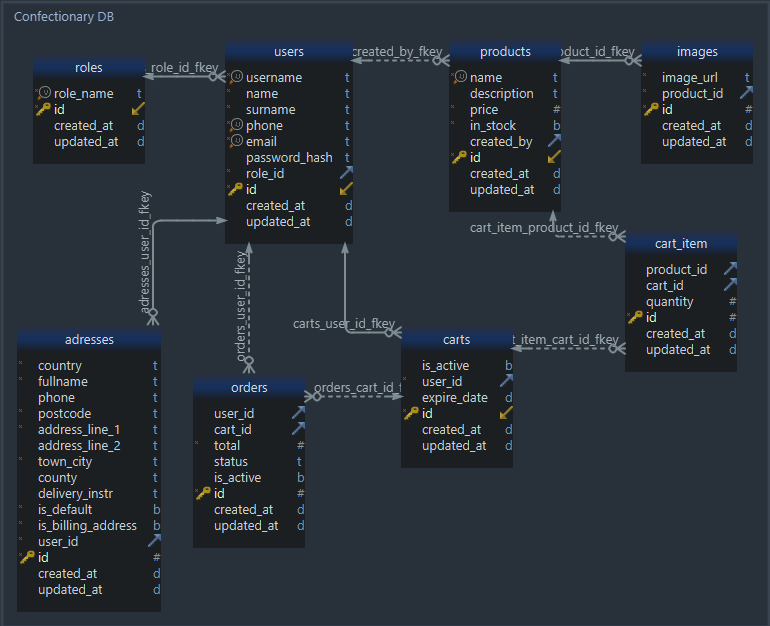

The seed.py file is designed to populate the database with data and test the data models. It begins by establishing a connection with the database, deleting any existing data and creating the necessary tables. Next, it proceeds to populate the tables with initial data. Upon completion, it will display the message "Database seeded!" if everything runs smoothly. However, if an error occurs, it will print an error message instead.

```python
#roles list, to be seeded into the role table, it has a relationship with the user table.
roles = ["Admin", "Owner", "Employee", "Customer"]

with app.app_context():

    try:
        print("Creating our database...")

        db.session.commit()
        db.drop_all()
        db.create_all()

        print("Seeding the database!")
        for role in roles:
            rolename = RoleModel(role_name=role)
            rolename.save()
            
        user = UserModel(
            email="admin@pastry.com",
            username="admin",
            password="1q2w3e4r5t6Y.",
            name="Carlos",
            surname="Teixeira",
            phone="07767668991",
            role_id=1,
        )
        user.save()
        
        user_customer = UserModel(
            email="customer@pastry.com",
            username="customer",
            password="1q2w3e4r5t6Y.",
            name="Carlos",
            surname="Teixeira",
            phone="07767668999",
        )
        user_customer.save()

        product = ProductModel(
            name="Banana Cake",
            description="Cake made of banana.",
            price=15.5,
            in_stock=True,
            created_by=user.id,
        )
        product.save()

        image = ImageModel(image_url="https://source.unsplash.com/500x500/?food-drink,Cake", product_id=product.id)
        image.save()
        print("Database seeded!")
    except Exception as e:
        print("exception", e)

```
Afterwards, I moved on to creating wireframes which illustrate the fundamental layout of my application, with only the essential features needed to meet the basic requirements of the project, known as Minimum Viable Product (MVP), in addition to some supplementary features for the Front-end, that would be implemented due to time frame. I used [Excalidraw](https://excalidraw.com/) to create the wireframes.

You can check the wireframes below:


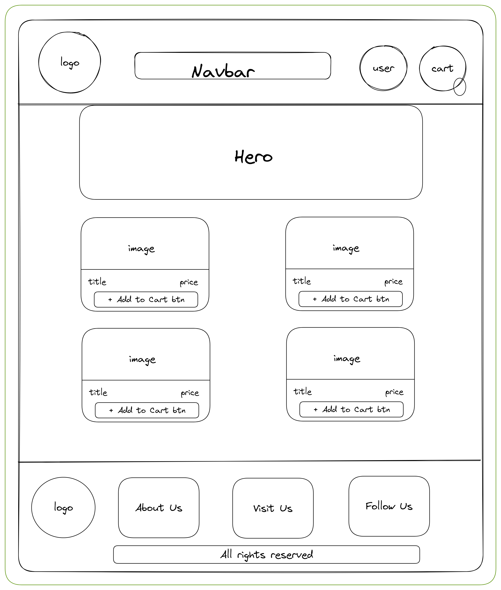

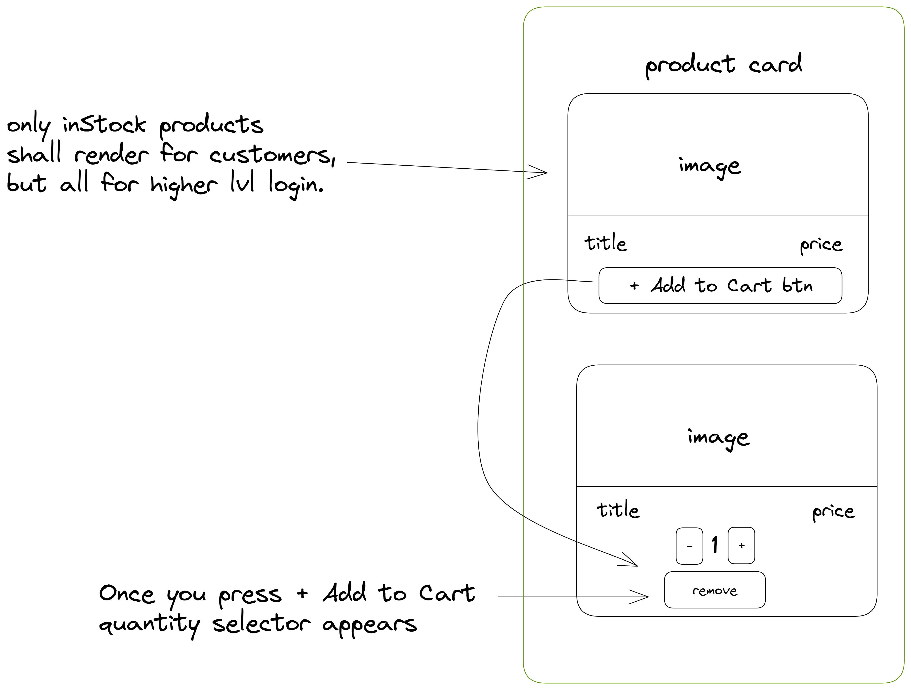
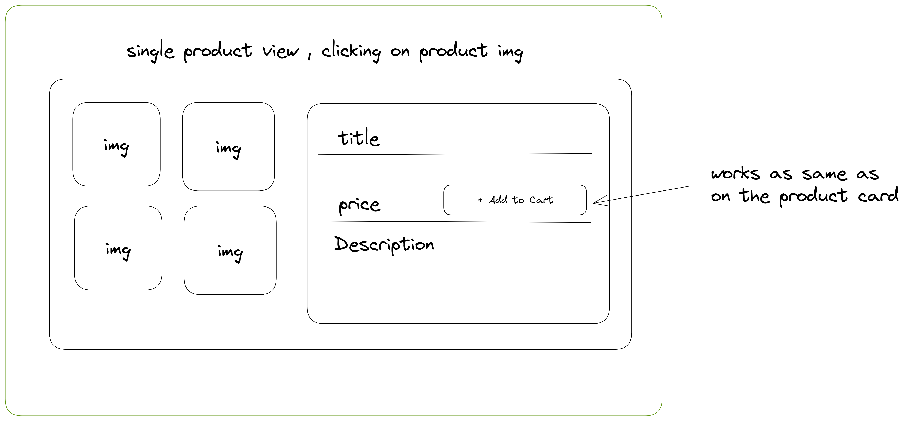
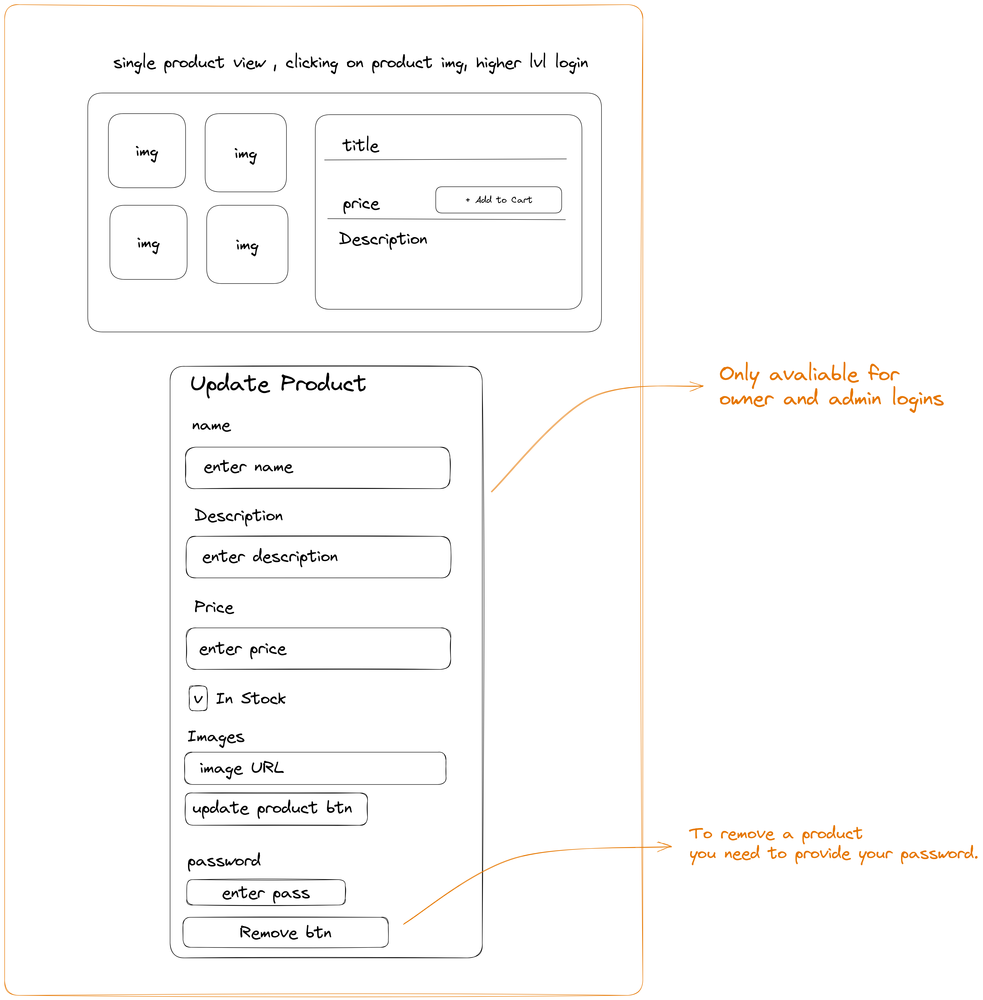
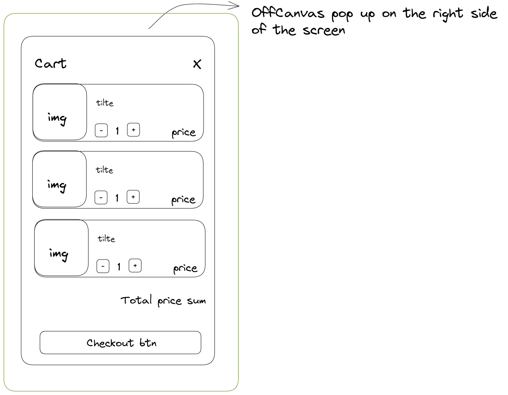
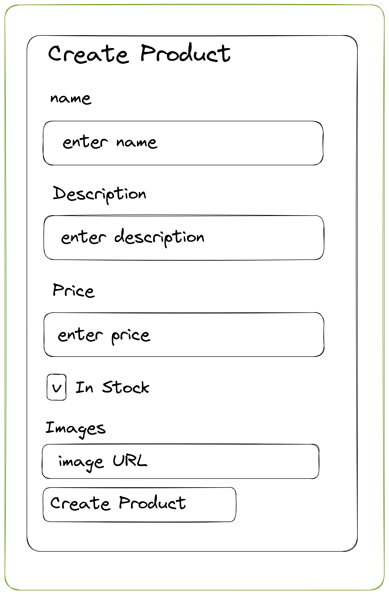

## Build/Code Process

### Back-end
To build the Back-end, I used the Flask framework in Python and adopted the MVC approach. I stored the data in a PostgreSQL database. <br>
First, I created the models for the database and established their relationships. Next, I wrote the API endpoints by creating routes. Unlike other MVC frameworks, such as Express, Flask links the routes, as a decorator, and controllers, as a function, together and relies on serializers to handle data conversion to/from JSON/dictionary formats. <br>
To integrate the API with the database, I utilized Flask-SQLAlchemy. Additionally, I employed Flask-Marshmallow for data serialization.

---
* Models - In terms of models, I began by creating a base model with common attributes and methods that would be inherited by all other models. I then proceeded to define all the necessary models for the database. Using SQLAlchemy, I established the relationships between the models through the ```db.relationship()``` method and the ```back_populates``` argument.

```python
class BaseModel:

    id = db.Column(db.Integer, primary_key=True)

    created_at = db.Column(db.DateTime, default=datetime.utcnow)
    updated_at = db.Column(
        db.DateTime, default=datetime.utcnow, onupdate=datetime.utcnow
    )

    def save(self):
        db.session.add(self)
        db.session.commit()

    def remove(self):
        db.session.delete(self)
        db.session.commit()
```
```python
class ProductModel(db.Model, BaseModel):
    #table name
    __tablename__ = "products"

    #table data
    name = db.Column(db.Text, nullable=False, unique= True )
    description = db.Column(db.Text, nullable=True, unique=False)
    price = db.Column(db.Float, nullable=False, unique=False)
    in_stock = db.Column(db.Boolean, nullable=False, default=True)
    created_by = db.Column(db.Integer, db.ForeignKey("users.id"),nullable=True)

    #relationships

    images = db.relationship("ImageModel", back_populates="product", cascade="all, delete-orphan")
    user = db.relationship("UserModel", back_populates="product")
    carts = db.relationship("CartItemModel", back_populates="product")
```

In my model design, I utilized two primary types of relationships. The first was a one-to-many connection that linked most of the models, such as the ```ProductModel``` and ```ImageModel```, and the ```UserModel``` and ```ProductModel```. The second relationship type was a many-to-many connection that linked the ```ProductModel``` and ```CartModel``` through the ```CartItemModel```. The ```CartItemModel``` is a join table that stores the foreign keys of the ```ProductModel``` and ```CartModel```, as well as the quantity of the selected product.


* one-to-many relationship between products and images, refer to the ```ProductModel``` above.
```python
class ImageModel(db.Model, BaseModel):
    __tablename__ = "images"
    image_url = db.Column(db.Text, nullable=False)
    product_id = db.Column(db.Integer, db.ForeignKey("products.id"), nullable=False)

    product = db.relationship("ProductModel", back_populates="images")
```

* many-to-many relationship between products and carts, refer to the ```ProductModel``` above.
```python
class CartModel(db.Model, BaseModel):
    # table name
    __tablename__ = "carts"
    # table data
    is_active = db.Column(db.Boolean, default=True)
    user_id = db.Column(db.Integer, db.ForeignKey("users.id"), nullable=False)
    expire_date = db.Column(db.DateTime, default=datetime.utcnow() + timedelta(days=1))
    # relationships
    products = db.relationship("CartItemModel", back_populates="cart", cascade="all, delete-orphan")
    user = db.relationship("UserModel", back_populates="carts")
    order = db.relationship("OrderModel", back_populates="cart", cascade="all, delete", uselist=False)
    # methods
    def is_expired(self, time_now):
        if time_now > self.expire_date:
            self.is_active = False
            self.save()
        return time_now > self.expire_date

class CartItemModel (db.Model, BaseModel):
    __tablename__ = "cart_item"

    product_id = db.Column(db.Integer, db.ForeignKey("products.id") )
    cart_id = db.Column(db.Integer, db.ForeignKey("carts.id") )
    quantity = db.Column(db.Integer, default = 1)


    product = db.relationship("ProductModel", back_populates= "carts")
    cart = db.relationship("CartModel", back_populates= "products")
```
---
* Routes / Controllers - the routers are straightforward and follow the RESTful convention. The Controllers relly on the try exception block to handle errors and prevent the server from crashing. I also used ```if``` statements to check through the incoming data and return the appropriate response.

```python
@router.route("/product/<int:prod_id>", methods=["GET"])
def get_product(prod_id):
    try:
        # getting product from db
        product = ProductModel.query.get(prod_id)
        # checking if product exists
        if not product:
            return {"message": "Product not found."},HTTPStatus.NOT_FOUND
        # returning product
        return product_schema.jsonify(product), HTTPStatus.OK
    except ValidationError as e:
        return {"errors": e.messages, "message": "Something went wrong"}
```
Another noteworthy aspect is the deletion route of the Product Controller. Apart from checking the user's role, I also implemented a feature that requires the user to enter their password to delete the product. This measure was taken to prevent unintended removal of products.

```python
@router.route("/product/<int:prod_id>", methods=["DELETE"])
@secure_route
def delete_product(prod_id):
    try:
        #getting user password from request
        user_pass = request.json["password"]
        #checking if user insert password
        if not user_pass:
            return {"message":"Please insert your password."}, HTTPStatus.UNAUTHORIZED
        #getting product from db
        product = ProductModel.query.get(prod_id)
        #checking if product exists
        if not product:
            return {"message": "Product not found."}, HTTPStatus.NOT_FOUND
        #getting user from db
        user = UserModel.query.get(g.current_user.id)
        #checking if user is admin or owner
        if user.role_id >=3:
            return {"message": "Unauthorized."}, HTTPStatus.UNAUTHORIZED
        # checking if user password is correct
        if not user.validate_password(user_pass):
            return {"message": "Unauthorized."}, HTTPStatus.UNAUTHORIZED
        # deleting product
        product.remove()
        # returning no content
        return "", HTTPStatus.NO_CONTENT
    except ValidationError as e:
        return {"errors": e.messages, "message": "Something went wrong"}
```
---
* Serializers were used to serialize and deserialize the data, with Marshmallow being the chosen tool. A significant advantage of serializers is that they can be used to populate response data fields that have relationships with other models. For instance, the ```CartSchema``` contains a ```products``` field that is populated using the ```CartItemSchema```, by leveraging the ```Nested``` property of the Marshmallow schema. The ```Nested``` property can also **cascade** from other schemas, such as the ```CartItemSchema``` that has a ```product``` field that is populated with the ```ProductforCartSchema```.

```python
class CartSchema(ma.SQLAlchemyAutoSchema):
    class Meta:
        include_fk = True
        model = CartModel
        load_instance = True
        load_only = ("created_at", "updated_at")
    products = fields.Nested("CartItemSchema", many=True)

class CartItemSchema(ma.SQLAlchemyAutoSchema):
    class Meta:
        include_fk = True
        model = CartItemModel
        load_instance = True
        load_only = ("created_at", "updated_at", "created_by")
    product = fields.Nested("ProductForCartSchema")
```

* Another benefit of using serializers is the ability to select specific fields to include in the response data. This is achieved by utilizing the ```load_only``` property, which excludes the designated fields from the response. This feature is helpful when sensitive data needs to be concealed, or when fields that are not required in the response can be excluded.

---

### Front-end

I utilized the React framework to construct the front-end of the application, which is a single page application that utilizes React Router for routing. The front-end comprises several components that are responsible for different pages and resources within the application.

Each component is designed to fulfill a specific task or purpose within the application, such as rendering product data or managing user authentication. By dividing the application into components, the code is more modular and easier to maintain.

The use of React Router enables seamless navigation between different pages and resources within the application, creating a smoother user experience. This also allows for better organization and management of the front-end code.

* The ```App``` component handles the routing and layout of the application and contains functions that manage the authentication of the ```user``` and the state of the ```cart```. As ```user``` and ```cart``` data are shared across multiple components in the application, the App component is the ideal location to handle and manage this data. This enables all child components to access and modify the state of them as needed.

```TypeScript
  function App() {
    const [user, setUser] = useState<null | IUser>(null)
    const [show, setShow] = useState(false)
    const [cart, setCart] = useState<null | ICart>(null)

   async function fetchUser() {
    const token = localStorage.getItem('token')

    const { data } = await axios.get(`${baseUrl}/user`, {
      headers: { Authorization: `Bearer ${token}` }
    })
    // console.log(data)

    setUser(data)
    fetchCart()

  }
  async function fetchCart() {
    const token = localStorage.getItem('token')
    const { data } = await axios.get(`${baseUrl}/cart`, {
      headers: { Authorization: `Bearer ${token}` }
    })
    setCart(data)
    // console.log(cart)
  }
    useEffect(() => {
    const token = localStorage.getItem('token')
    if (token) fetchUser()
  }, [])
    useEffect(() => {
    fetchCart()
  }, [user])
```
* In the ```Home``` component, the product data is displayed as individual cards. Depending on the user role, they may have access to the full list of products or just the ones that are currently in stock. <br> <br>To achieve this, the products are conditionally rendered based on the user's role. If the user has a lower role, such as a customer, they will only see the products that are currently in stock. If the user has a higher role, they will see the full list of products. <br> <br> The conditional rendering logic allows for a personalized user experience based on their role, as shown below.

```TypeScript
      <Container>
      <Image src={Hero} className="rounded mb-3" fluid={true} style={{width:"100%"}}/>
        <Row xs={1} sm={1} md={2} lg={2} xl={3} className="g-3">
          {/* mapping over the products and rendering them, if the user is not logged in or user role is customer, only show the products that are in stock, else show all products. */}
          {Products?.map(product => ( !user || user?.role_id > 3 ?
            product.in_stock && <Col key={product.id}>
              {
                <Product {...product} fetchCart={fetchCart} cart={cart} />
              }
            </Col> :  <Col key={product.id}>
              {
                <Product {...product} fetchCart={fetchCart} cart={cart} />
              }
            </Col>
              ))}
        </Row>
      </Container>
```
To create the ```Cart``` component, I utilized the ```Offcanvas``` component available in the ```react-bootstrap``` library. This allowed me to achieve the desired sidebar effect that can be toggled on and off. The ```show``` state is responsible for toggling the ```Cart``` component and is passed as a prop to both the ```Cart``` and ```Navbar``` components. The ```show``` state is updated by clicking on the cart button in the Navbar component.

```TypeScript
//button to toggle the cart from the navbar.
  {user && <Button
    style={{ width: '3rem', height: '3rem', position: 'relative' }}
    variant="outline-primary"
    className="rounded-circle mx-2 my-2"
    onClick={()=>{setShow(true)}}
  >

// show state on the app component is passed as a prop to the cart and navbar components.
const [show, setShow] = useState(false)
<Navbar user={user} setUser={setUser} show={show} setShow={setShow} cart={cart} setCart={setCart}/>
<Cart show={show} setShow={setShow} cart={cart} />

// the cart component is rendered as an offcanvas component.
    <Container>
      <Offcanvas  className="bg-light" show={show} onHide={handleClose} placement="end">
        <Offcanvas.Header closeButton>
          <Offcanvas.Title>Cart</Offcanvas.Title>
        </Offcanvas.Header>
        <Offcanvas.Body>
          <Stack gap={3}>
          {cart.products.map(item => (
            <CartItem key={item.id} {...item} />
          ))}
          <div className="ms-auto fw-bold fs-5">
            Total{" "}
            {formatCurrency(
              cart.products.reduce((total, cartItem) => {
                return total + (cartItem.product?.price || 0) * (cartItem.quantity || 0)
              }, 0)
            )}
          </div>            
          </Stack>
          {cart.products.length > 0 &&<Button className="w-100 mt-3" onClick={handleClose}>Checkout</Button>}
        </Offcanvas.Body>
      </Offcanvas>
    </Container>
```
The purpose of the formatCurrency function is to format the total price of the cart with the correct currency symbol and decimal places. This function utilizes the **[internationalization API](https://tc39.es/ecma402/#numberformat-objects)** to achieve this.

The internationalization API provides a way to format numbers and currencies based on the user's language and location. In the case of the formatCurrency function, it is used to format the total price with the appropriate currency symbol and decimal places for the user's locale.

```TypeScript
// Cart component
          <div className="ms-auto fw-bold fs-5">
            Total{" "}
            {formatCurrency(
              cart.products.reduce((total, cartItem) => {
                return total + (cartItem.product?.price || 0) * (cartItem.quantity || 0)
              }, 0)
            )}
          </div>

// formatCurrency function
const currencyFormatter = new Intl.NumberFormat(undefined, {
  style: 'currency',
  currency: 'GBP',
  minimumFractionDigits: 2,
  maximumFractionDigits: 2,
});

export function formatCurrency(value: number) {
  return currencyFormater.format(value);
}
```

---

You can see below some snapshots of the app, at different conditions.

* **Home page no products**

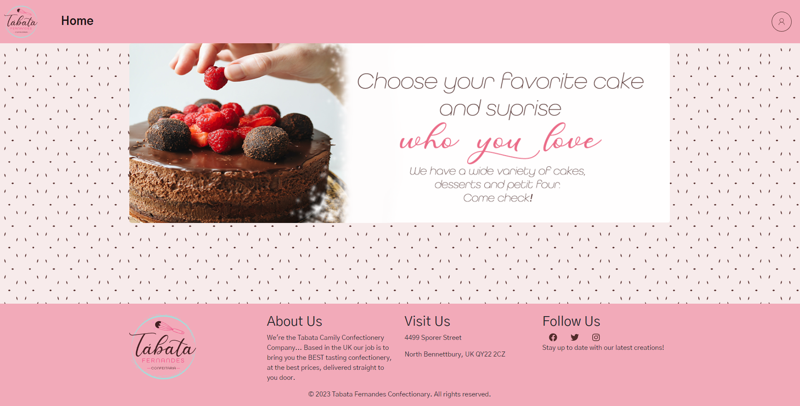

* **Home page logged as customer**


* **Home page logged as admin**<br><br>Here you can see that the admin has access to the full list of products, including the ones that are out of stock. The 3rd product is out of stock, no ( +Add To Cart button). 


* **Create Product Form** <br><br> The create product form is available to the admin, owner and employee roles.

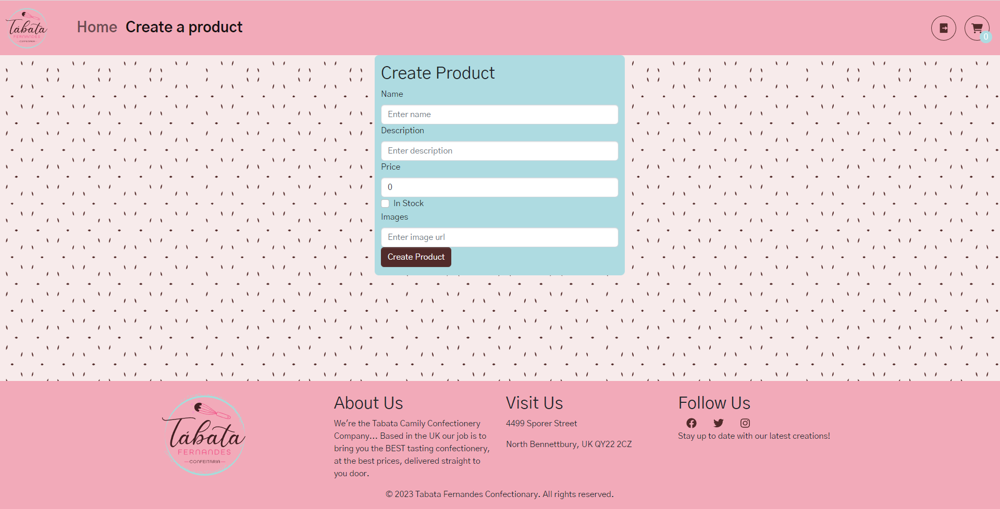

* **Sign in / Sign up page**


* **Product Card Customer**

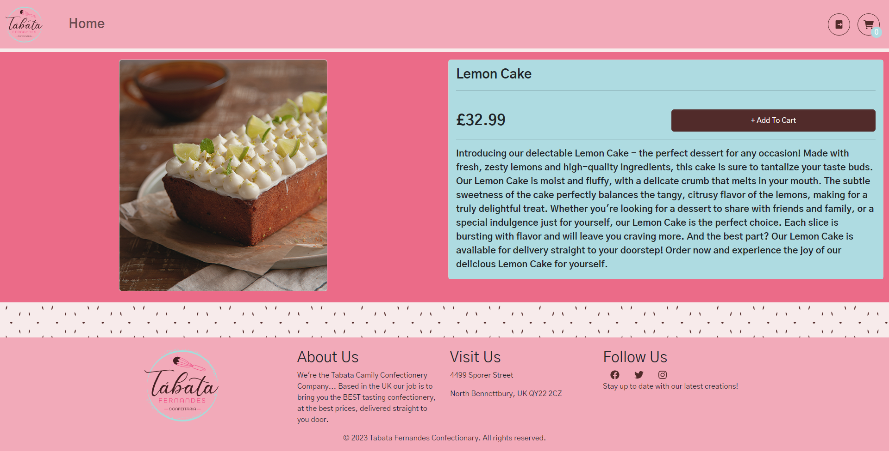

* **Product Card Admin** <br><br> The product card for the admin has an extra form to edit / delete the product.


* **Cart**


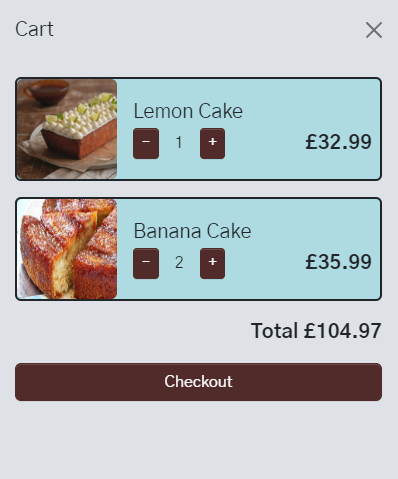

## Challenges

I had difficulty switching from Flask/Python to React/TypeScript because of the syntax differences between the two languages. Although I had been working with Python for a full month in the back-end of the project and during classes, it took me an entire day to remember the TypeScript syntax and use it naturally when I started working on the front-end.


## Wins
When handling product creation, I faced a challenge that I solved and it was a win for me, as the Front-end sent both product and image data in the same request. However, I could not use the raw request data to create the product or the image. To handle this, I used the ```unknown = EXCLUDE``` property of the Marshmallow schema to prevent the schema from accepting any data that was not defined in it for the product. As for the image, I created a separate dictionary that only contained the relevant data from the request and the product, and then loaded it into the image schema using the ```load``` method. This allowed me to create both data entries in the same request.

```python
@router.route("/product", methods=["POST"])
@secure_route
def create_product():
    try:
        # getting product data from request
        product_dictionary = request.json
        # adding user id to product data
        product_dictionary["created_by"] = g.current_user.id
        # checking if user is not customer
        if g.current_user.role_id >= 4:
            return {"message": "Unauthorized."}, HTTPStatus.UNAUTHORIZED
        # creating product
        product = product_schema.load(product_dictionary, unknown=EXCLUDE)
        # saving product
        product.save()
        # getting image data from request and adding product id
        image_dictionary = {"product_id": product.id, "image_url": request.json["image_url"]}
        # creating image
        image = image_schema.load(image_dictionary)
        # saving image
        image.save()
        # returning product
        return product_schema.jsonify(product), HTTPStatus.CREATED
    except ValidationError as e:
        return {"errors": e.messages, "message": "Something went wrong"}
```

I have utilized advanced TypeScript features, such as ```Partial``` type, which enables the Front-end to transmit only the relevant data to be updated, as demonstrated in the ```ShowProduct``` component. I applied ```Partial``` type to the ```formDataUpdateProd``` state and the ```newFormDataUpdateProd``` constant, which utilizes ```Partial``` type in conjunction with the intersection type (&) to create a new type that includes the characteristics of both. I utilized ```{ [key: string]: any }``` to allow the ```input.name``` property to be utilized as a key in the ```newFormDataUpdateProd``` object. As the ```input.name``` may take on various values, this type specifies that the key should be a string and the accepted values should be any.
  
  ```typescript
  interface IProduct {
  name: string,
  description: string,
  price: number,
  in_stock: boolean,
  createdBy: number,
  id: number,
  isHome: boolean,
  images: Array<Partial<IImage>>
  fetchCart:Function
} 
  const [formDataUpdateProd, setFormDataUpdateProd] = useState<Partial<IProductCreate>>({
  name: product?.name,
  description: product?.description,
  price: product?.price ,
  in_stock: product?.in_stock,
  image_url: ""
})

  function handleChangeUpdateProd(event: ChangeEvent<HTMLInputElement>) {
    const newFormDataUpdateProd: Partial<IProduct> & { [key: string]: any } =
      structuredClone(formDataUpdateProd)
``` 


## Key Learnings/Takeaways
### Front-end
* I learned how to work with TypeScript complex types, as mentioned in the "Wins" section.
* The internationalization API was a great learning experience, as I had never used it before.
* I made use of React Bootstrap components, in the proper way.
* I learned how to customize the Bootstrap Fonts and Colors using Scss.

### Back-end
* Currently, Python is my second language, and it is a significant accomplishment for me. Although I am not yet fluent in it and require further improvement, I am capable of reading and comprehending Python code.

* I got the concept of pipenv and how to use it to create virtual environments.

* I learned how to create my own decorators, which I used to secure the routes, but it can be used for other purposes as well.

* I got a good understanding of the flask framework and how to use it to create a RESTful API.


## Future Improvements
* Implementing a search bar to search for products by some criteria.
* Implementing a feature that allows the user to sort products by price, name, etc.
* Implementing the integration of a payment gateway as Stripe.
* Implementing the integration of the Cloudinary API to allow the user to upload images without having to provide a URL.
* Implementing the order page.
* Improving the responsiveness of the website.
* Fixing the buttons on the cart page.
* Deploying the Back-end with a deployment server such as Gunicorn.